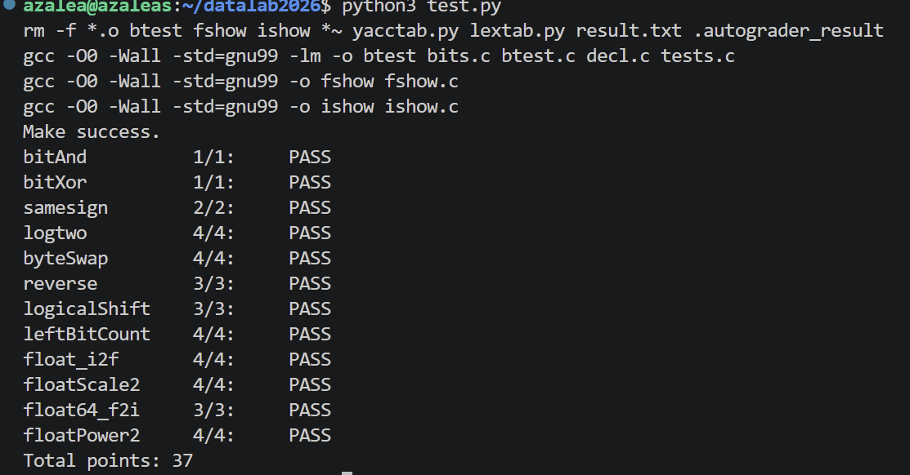

# datalab 报告

姓名：张宇琪
学号：2025201819

## 测试结果

完成修改后，我运行了 `python3 test.py`。测试截图显示 `Make success.`，12 个函数全部为 **PASS**，最终输出 `Total points: 37`。按截图中各题的满分合计，本次本地测试结果为 **37/37**。

| 函数 | 本次得分 | 本次状态 |
| --- | ---: | :---: |
| `bitAnd` | 1/1 | PASS |
| `bitXor` | 1/1 | PASS |
| `samesign` | 2/2 | PASS |
| `logtwo` | 4/4 | PASS |
| `byteSwap` | 4/4 | PASS |
| `reverse` | 3/3 | PASS |
| `logicalShift` | 3/3 | PASS |
| `leftBitCount` | 4/4 | PASS |
| `float_i2f` | 4/4 | PASS |
| `floatScale2` | 4/4 | PASS |
| `float64_f2i` | 3/3 | PASS |
| `floatPower2` | 4/4 | PASS |
| **合计** | **37/37** | **全部 PASS** |


**test 截图：**




## 解题报告

### 亮点

1. `logicalShift`：从 `n=0` 的反例定位错误移位，重新构造覆盖边界的掩码。
2. `float_i2f`：保留查找最高有效位的实现，分别处理隐藏位、舍入和进位。

下面复盘我比较有收获的五个函数。

### logicalShift：掩码必须覆盖零位移边界

初次测试的反例是 `logicalShift(-2147483648, 0)`：程序返回 0，预期应保持输入不变。原来的掩码我使用了 `(1 << 31) >> (n + ~0)`，其中 `n + ~0` 等于 `n-1`，导致 `n=0` 时右移次数为 -1，修改后的掩码如：。


```c
int x_shift = x >> n;
int mask = ~(((1 << 31) >> n) << 1);
return x_shift & mask;
```

负数算术右移后，高位会补 1；掩码的作用就是清掉这些补入位。按本实验的位运算模型，该掩码在 `n=0`、`n=1`、`n=31` 时分别为 `0xFFFFFFFF`、`0x7FFFFFFF`、`0x00000001`，不再需要计算 `n-1`。这次修改让我意识到，构造掩码时要先明确保留哪些位，并检查移位范围的两端。

### float_i2f：隐藏位、舍入和进位分开处理

初次测试中，输入 `8388608` 时返回 `0x4B800000`，预期为 `0x4B000000`。

**最高有效位与隐藏位。** 最终代码没有采用讨论中“先把最高位移到第 31 位”的替代实现，而是将幅值保存在无符号变量 `abs_x` 中，通过不断右移 `tmp` 求出最高有效位的位置 `shift`，再计算 `exp = shift + bias`，其中 `bias=127`。

当 `shift <= 23` 时，可以保留全部有效位，但必须用掩码去掉隐藏位：

```c
if (shift <= 23)
    frac = (abs_x << (23 - shift)) & 0x7FFFFF;
```

对于 `8388608 = 2^23`，最高有效位就是隐藏位，去掉后 `frac=0`。原实现没有这一步屏蔽，把隐藏位混入了 fraction。

**舍入判断。** 当 `shift > 23` 时，需要舍弃低位。最终代码保留下面这些信息：

```c
int rshift = shift - 23;
frac = (abs_x >> rshift) & 0x7FFFFF;
tmp = (abs_x >> (rshift - 1)) & 1;
round_bit = tmp;
sticky = abs_x & ((1 << (rshift - 1)) - 1);
```

`round_bit` 是被舍弃部分的最高位；`sticky` 保存其余被舍弃的低位，并不是已经归一化的 0/1 标志，判断时只关心它是否非零。`round_bit=0` 时不进位；为 1 且 `sticky` 非零时进位；恰好居中时，根据 `frac` 的最低位决定是否进位，实现“就近舍入，居中取偶数”。

最终代码用嵌套判断和 `sticky + (frac & 1)`，避开了原来不允许的逻辑运算符。这里两项均非负，和非零恰好表示至少一项非零：

```c
if (round_bit) {
    if (sticky + (frac & 1)) {
        frac++;
        if (frac >> 23) {
            frac = 0;
            exp++;
        }
    }
}
```

**舍入后的进位。** `frac++` 可能产生第 24 位，此时需要清零 fraction 并让指数加一，不能直接拼接溢出后的尾数。最终再以 `sign | (exp << 23) | frac` 组合结果。本次该函数得到 4/4。


### samesign：零单独处理，注意取反范围

初次测试中，`samesign(2147483647, -2147483648)` 错误地返回 1；原程序还使用了本题不允许的 `|`。

题目规定零既不为正也不为负，因此两个零应返回 1，而恰好有一个零时返回 0。最终先处理零，再比较两个非零数的符号：

```c
if (!x) return !y;
if (!y) return 0;
return !((x >> 31) ^ (y >> 31));
```

原表达式 `!(x >> 31) ^ (y >> 31)` 只对左侧取反，不等于对整个异或结果取反。修改后的括号明确限定了 `!` 的作用范围。


### floatScale2：不能同时保留新旧 fraction

初次反例 `floatScale2(1)` 的预期结果是 2，程序却返回 3。这里的 `1` 是浮点编码 `0x00000001`，不是浮点数 `1.0`。

原因是原掩码 `0x807FFFFF` 同时保留了符号位和原 fraction，再与左移后的 fraction 按位或，就把新旧尾数混在一起。最终源码的分支为：

```c
unsigned exp = (uf >> 23) & 0xFF;
if (exp == 0)
    return (uf & 0x80000000) | ((uf & 0x007FFFFF) << 1);
if (exp == 0xFF) return uf;
return uf + 0x00800000;
```

`exp=0` 时只保留原符号位，尾数字段左移；`exp=255` 时保留输入编码；其余输入由最后一行增加指数域。本次脚本给该函数 4/4。

**边界说明：** 当前代码没有为 `exp=254` 设置单独的上溢分支。例如按最后一行计算，`0x7F000001` 会变成 `0x7F800001`，尾数字段仍非零。这个边界仍需核查，不能把所附脚本的通过结果写成所有边界都已单独验证。


### leftBitCount：分段统计，并补齐最后两位

这个函数在初次和本次测试中都得到 4/4。实现依次检查最高的 16、8、4、2 位是否全为 1。第一段为：

```c
is_all_1 = !(~(x >> 16));
ans += is_all_1 << 4;
x = x << (is_all_1 << 4);
```

在实验的算术右移模型下，高 16 位全为 1 时，`x >> 16` 等于全 1 位模式，取反再逻辑非就得到 1。此时累计 16 并左移，继续检查后续位；否则不移动，改查更短的前缀。8、4、2 位的处理采用同一方式。

前四段最多累计 30，还需要处理末尾两位：

```c
int high = (x >> 31) & 1;
ans = ans + high;
mask = ~(high + ~0);
x = x & mask;
x = x << 1;
ans = ans + ((x >> 31) & 1);
```

`high=0` 时，`mask=0`，后面的位不能继续计数；`high=1` 时，掩码全为 1，可以继续检查下一位。这样既能在首次遇到 0 时停止计数，又能让全 1 输入得到 32。

课上学习让我学会了二分法分治的思想，但是在做题的时候，我忽略了前31位都是1时最后一位的检查，以至于输入-1无法通过测试。这让我意识到处理边界问题的重要性。


## 反馈/收获/感悟/总结

这次实验让我体会到，位运算不仅要算对结果，还要满足每题的表达式限制，我会思考怎样将操作数控制在规定范围之内，还会尝试用多种方式表示一些题目中不能使用的逻辑运算符。在这过程中，我对移位边界、掩码和舍入进位的理解更具体了。AI 帮助我分析反例并提出修改建议，让我意识到我有时对一些边界情况欠缺思考。本次脚本得到 37 分，也提醒我测试通过不等于所有边界都已单独验证，例如floatScale2中的上界问题。

